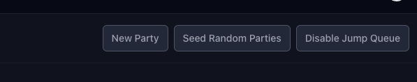

# Tablecheck Backend Takehome

This is the backend application for the Tablecheck SWE take-home assignment, built with Ruby on Rails. It sets up a Ruby on Rails backend API for the corresponding frontend application. It also includes the set-up for a PostgreSQL and Redis server on Docker, which the application will interact with.

## Installation & Set Up

NOTE:
Make sure you have Docker installed

- Docker (v25 and up)
- Docker Desktop (v4 and up)

```bash
git clone https://github.com/SandraBayabos/tablecheck-swe-takehome-be.git
cd tablecheck-swe-takehome-be
docker-compose up -d
```

You may now view the admin dashboard on [http://localhost:3000](http://localhost:3000) and sign in with the following credentials:

```bash
admin
admin123
```

---

# Explanation on Infrastracture & Architecture

## Sidekiq

`Sidekiq` is being used to run a background job `ProcessTableServiceJob`, and leverages `Redis` to manage the job queue. As per the project requirements, the job processes the queue status of parties, i.e. moving them from `in_queue` to `pending_check_in` to `seated`, and also handles the table service time for `seated` parties to `finished`.

## Cookies

Cookies are used to manage each party's session for authenticating the current party and persisting their session data in their browser even if they open up the app on a different tab or refresh the page. A party's cookies are set to expire 1 day after entering the queue, on the basis that it is unlikely the same party will visit the restaurant multiple times in a day.

## Admin Dashboard

### Client-Facing Dashboard

An admin dashboard using Rail's Active Admin was included as part of the backend code in order to provide a "client-facing" dashboard.
This ensures the client is able to visually keep track of queueing customers.

### Seeding Parties

For developers testing the application, a "Seed Random Parties" button is included on the dashboard to initialise a starting-point of a "fully-booked" restaurant. Then when new test parties are added in the entire flow of 1. Creating a Party, 2. Waiting in the Queue, 3. Checking In and 4. Completing the Service can be viewed from the dashboard for easier testing.

### Queue Issues

One potential issue I noticed was that customers who were `pending_check_in` but never clicked the Check In button in the app, could potentially hold up the queue for a very long time.

The admin dashboard allows the client to view which parties are holding up the queue and potentially delete their party to allow subsequent parties to check in.

I have also created an Allow Jump Queue feature, which may be toggled true or false in the dashboard. This feature enables flexibility in processing a queue by allowing smaller parties to bypass a larger party that is currently blocking the queue due to capacity constraints. This ensures the restaurant can optimize its seating without leaving unutilized capacity.

------------------------------------------
For example:

The maximum capacity of the restaurant is 10.
Current queue:

- party_id 1: size 5
- party_id 2: size 8
- party_id 3: size 2

If the Allow Jump Queue is toggled to `false`, if party_id 1 is seated, in spite of there being capacity for party_id 3, party_id 3 will be blocked checking in until party_id 2 has finished their meal.

Toggling Allow Jump Queue to `true` will allow for party_id 3 to be prioritised over party_id 2 because there is sufficient seating available in the restaurant

------------------------------------------

### Other Configurable Settings



The maximum capacity of the restaurant can also be adjusted on the admin dashboard so the app can be used by restaurants of varying capacities and/or if the restaurant capacity ever changes for any reason.

The service time per party member is also configurable purely for development test purposes.
